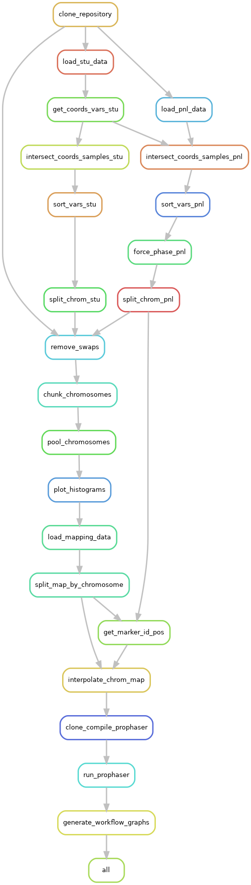

[](https://snakemake.readthedocs.io)

# poolimputeSNPs: a Snakemake workflow for simulating pooled genotyping experiments with SNPs followed by genotype imputation

The workflow uses as example the data from the [**NIAB Diverse MAGIC wheat population**](http://mtweb.cs.ucl.ac.uk/mus/www/MAGICdiverse/).



## Table of contents

1. [Requirements](#requirements)
2. [Installation and configuration](#installation-and-configuration)
3. [Usage with a container](#usage-with-a-container)
4. [Usage without container](#usage-without-container)

## Requirements

You need to install the following tools:

* __conda__: Please see the documentation: https://conda.io/projects/conda/en/latest/user-guide/install/index.html

* __Snakemake__: Please see the documentation: https://snakemake.readthedocs.io/en/stable/getting_started/installation.html

* __Apptainer__ (formerly Singularity) if the workflow is to be run in the provided container: https://apptainer.org/docs/admin/main/installation.html#installation

* `git`

You also need a Linux-based OS for executing the workflow.

## Installation and configuration

Clone the repository `git clone https://github.com/camcl/poolimputeSNPs.git` and navigate to the directory:

```
cd poolimputeSNPs
```

Unless differently specified, all paths and commands are relative to the directory `poolimputeSNPs`.

Edit the configuration file `config/config.yml` depending on whether the imputation step of the workflow should be executed or not.
By default, no imputation is triggered after simulating.
Two options for imputation are available:

* `'prophaser'`

* `none` (default)

__Warning:__ due to the memory requirements of the program, `'prophaser'` must be run only in a cluster environment.

NB: An example of script for running imputation with Beagle 4.1..along with a genetic map in the required plink format are provided in the repository of `genotypooler` (branch _magicwheat_).

## Usage with a container

** Recommended usage, even necessary if running on a cluster.**
Using the provided container avoids creating the (very large-sized) conda environment.


### Verify the installation of Apptainer

If the installation is correct, the command `apptainer --version` should print out `apptainer version X.Y.Z`, depending on the latest release.


### Build the container image

The image of the container (ca. 850 MB) in which the workflow is run must be built from the `container.def` file:

```
apptainer build container.sif container.def
```

The building operation can take up to a few minutes, during which the conda packages are installed first, followed by the Python packages via pip.
On a (HPC) cluster, the option `--fakeroot` will be used by default when building and later when executing or running programs in the container.
If the build is succesful, the end of the output looks like

```
Cleaning tarballs..
Cleaning packages..
INFO:    Adding environment to container
INFO:    Adding runscript
INFO:    /etc/singularity/ exists; cleanup by system administrator is not complete (see https://apptainer.org/docs/admin/latest/singularity_migration.html)
INFO:    Creating SIF file...
INFO:    Build complete: container.sif
```

### Execute the workflow locally

Reminder: the configuration must be `imputation: 'none'`.

For dry-running the workflow in the container image with 4 cores , enter the command `apptainer run container.sif -c 4 -n`.
A dry-run displays what rules of the workflow will be executed and the reason triggering this execution, however nothing is actually run and no files are written.

If the dry-run does not produce any error, the workflow can be actually run in the container image with the command `apptainer run container.sif -c 4` (4 cores are used for the run).


### Execute the workflow on a compute cluster (via SLURM system)

Run `sbatch workflow/scripts/run_workflow.sbatch`.

First lines of the output (it might be written to a specific SLURM ouput file) with the configuration `imputation: 'prophaser'`:

```
Building DAG of jobs...
Using shell: /usr/bin/bash
Provided cores: 16
Rules claiming more threads will be scaled down.
Singularity containers: ignored
Job stats:
job                             count    min threads    max threads
----------------------------  -------  -------------  -------------
all                                 1              1              1
chunk_chromosomes                  21              1              1
clone_compile_prophaser             1              1              1
clone_repository                    1              1              1
force_phase_pnl                     1              1              1
generate_workflow_graphs            1              1              1
get_coords_vars_stu                 1              1              1
get_marker_id_pos                  21              1              1
interpolate_chrom_map              21              1              1
intersect_coords_samples_pnl        1              1              1
intersect_coords_samples_stu        1              1              1
load_mapping_data                   1              1              1
load_pnl_data                       1              1              1
load_stu_data                       1              1              1
plot_histograms                    21              1              1
pool_chromosomes                   21              1              1
remove_swaps                       21              1              1
run_prophaser                       1              1              1
sort_vars_pnl                       1              1              1
sort_vars_stu                       1              1              1
split_chrom_pnl                    21              1              1
split_chrom_stu                    21              1              1
split_map_by_chromosome            21              1              1
total                             203              1              1

Select jobs to execute...

[Mon Mar 20 17:22:24 2023]
rule clone_repository:
    output: opt/genotypooler/genotypooler, opt/genotypooler/genotypooler/runtools/rm_swapped_ref_alt.py
    log: results/logs/install_genotypooler/clone_repository.log
    jobid: 17
    resources: tmpdir=/scratch/7430565

Cloning into 'genotypooler'...
Switched to a new branch 'magicwheat'
...
```

Upon successful execution, the last lines of the output should  look like:

```
[Mon Mar 20 17:25:31 2023]
localrule all:
    input: results/rulegraph.png, results/jobgraph.png
    jobid: 0
    resources: tmpdir=/scratch/7430565

[Mon Mar 20 17:25:31 2023]
Finished job 0.
203 of 203 steps (100%) done
Complete log: /crex/proj/snic2019-8-216/private/MagicWheatWorkflow/poolimputeSNPs/.snakemake/log/2023-03-20T172219.551989.snakemake.log
Success! The Snakemake workflow is completed.
```

### Post processing of the imputed files

If you have run prophaser, the imputed sample files must be merged and reordered with

```
apptainer exec container.sif micromamba run -n base bash workflow/scripts/merge_sort_vcf_files.sh results/data/1/prophaser *.full.postgenos.vcf.gz results/data/study.population results/data/1
```

This should create a file `results/data/1/STU.Chr1.SNPs.pruned.sorted.pooled.imputed.vcf.gz`and its CSI index that you can process with bcftools.


### Notes about running 'prophaser' imputation in the workflow

The script files provided as examples are specific to the compute cluster 'Snowy' at [UPPMAX](https://www.uppmax.uu.se) which is managed with SLURM.
prophaser was executed for each sample on 1 node (16 cores). The execution time of the workflow might be longer if fewer and/or smaller cores are used.
You may adapt the following scripts (in `workflow/scripts`) for making them compatible with your remote computing environment:

* *set_SlurmUser.sh*: adapt the locations of:
	* the configuration file for SLURM,
	* the relevant libraries,
	* the executable for `sbatch`
	* More examples and documentation at [GWDG wiki](https://info.gwdg.de/wiki/doku.php?id=wiki:hpc:usage_of_slurm_within_a_singularity_container)

* *run_workflow.sbatch*, *run_workflow_prophaser.sbatch*: adapt the `#SBATCH` flags.

* *run_workflow.sh*: adapt the option `-c 16` accordingly to the number of available CPU on your system and in your sbatch commands. Also adapt the paths to be bound in the container at running.


## Usage without container 

For local execution.

**Important:** Keep in mind that installing the conda environment on a machine requires a large amount of space in memory (ca. 2.2 GB).

### Initialize and activate the main conda environment for the project

Clone the repository `poolimputeSNPs`, do not change the configuration file (e.g. `imputation` remains `'none'`).

Run the following command: `conda env create -f workflow/envs/smkenv.yml --prefix ./envs python=3.6`, it might take a while.
The output should look like:

```
(base) poolimputeSNPs$ conda env create -f workflow/envs/smkenv.yml --prefix ./envs python=3.6
Collecting package metadata (repodata.json): done
Solving environment: done
Preparing transaction: done
Verifying transaction: done
Executing transaction: \ 
- 
done
Installing pip dependencies: - Ran pip subprocess with arguments:
['poolimputeSNPs/workflow/envs/bin/python', '-m', 'pip', 'install', '-U', '-r', 'poolimputeSNPs/workflow/envs/condaenv.iqkqi5b8.requirements.txt']
Pip subprocess output:
Requirement already satisfied: pandas in ./lib/python3.6/site-packages (from -r poolimputeSNPs/workflow/envs/condaenv.iqkqi5b8.requirements.txt (line 1)) (1.1.5)
Collecting pysam==0.17.0
  Using cached pysam-0.17.0-cp36-cp36m-manylinux_2_5_x86_64.manylinux1_x86_64.whl (12.3 MB)
Requirement already satisfied: numpy<1.20 in ./lib/python3.6/site-packages (from -r poolimputeSNPs/workflow/envs/condaenv.iqkqi5b8.requirements.txt (line 3)) (1.19.5)
Collecting seaborn
  Using cached seaborn-0.11.2-py3-none-any.whl (292 kB)
Collecting img2pdf
  Using cached img2pdf-0.4.4-py3-none-any.whl
Collecting numba
  Using cached numba-0.53.1-cp36-cp36m-manylinux2014_x86_64.whl (3.4 MB)
Collecting scikit-learn
  Using cached scikit_learn-0.24.2-cp36-cp36m-manylinux2010_x86_64.whl (22.2 MB)
Collecting build
  Using cached build-0.9.0-py3-none-any.whl (17 kB)
Collecting setuptools_scm
  Using cached setuptools_scm-6.4.2-py3-none-any.whl (37 kB)
Requirement already satisfied: python-dateutil>=2.7.3 in ./lib/python3.6/site-packages (from pandas->-r poolimputeSNPs/workflow/envs/condaenv.iqkqi5b8.requirements.txt (line 1)) (2.8.2)
Requirement already satisfied: pytz>=2017.2 in ./lib/python3.6/site-packages (from pandas->-r poolimputeSNPs/workflow/envs/condaenv.iqkqi5b8.requirements.txt (line 1)) (2022.7.1)
Requirement already satisfied: scipy>=1.0 in ./lib/python3.6/site-packages (from seaborn->-r poolimputeSNPs/workflow/envs/condaenv.iqkqi5b8.requirements.txt (line 4)) (1.5.3)
Requirement already satisfied: matplotlib>=2.2 in ./lib/python3.6/site-packages (from seaborn->-r poolimputeSNPs/workflow/envs/condaenv.iqkqi5b8.requirements.txt (line 4)) (3.3.4)
Requirement already satisfied: Pillow in ./lib/python3.6/site-packages (from img2pdf->-r poolimputeSNPs/workflow/envs/condaenv.iqkqi5b8.requirements.txt (line 5)) (8.2.0)
Collecting pikepdf
  Using cached pikepdf-3.2.0-cp36-cp36m-manylinux_2_12_x86_64.manylinux2010_x86_64.whl (2.0 MB)
Requirement already satisfied: setuptools in ./lib/python3.6/site-packages (from numba->-r poolimputeSNPs/workflow/envs/condaenv.iqkqi5b8.requirements.txt (line 6)) (58.0.4)
Collecting llvmlite<0.37,>=0.36.0rc1
  Using cached llvmlite-0.36.0-cp36-cp36m-manylinux2010_x86_64.whl (25.3 MB)
Collecting joblib>=0.11
  Using cached joblib-1.1.1-py2.py3-none-any.whl (309 kB)
Collecting threadpoolctl>=2.0.0
  Using cached threadpoolctl-3.1.0-py3-none-any.whl (14 kB)
Collecting pep517>=0.9.1
  Using cached pep517-0.13.0-py3-none-any.whl (18 kB)
Collecting tomli>=1.0.0
  Using cached tomli-1.2.3-py3-none-any.whl (12 kB)
Requirement already satisfied: importlib-metadata>=0.22 in ./lib/python3.6/site-packages (from build->-r poolimputeSNPs/workflow/envs/condaenv.iqkqi5b8.requirements.txt (line 8)) (4.8.1)
Requirement already satisfied: packaging>=19.0 in ./lib/python3.6/site-packages (from build->-r poolimputeSNPs/workflow/envs/condaenv.iqkqi5b8.requirements.txt (line 8)) (21.3)
Requirement already satisfied: typing-extensions>=3.6.4 in ./lib/python3.6/site-packages (from importlib-metadata>=0.22->build->-r poolimputeSNPs/workflow/envs/condaenv.iqkqi5b8.requirements.txt (line 8)) (4.1.1)
Requirement already satisfied: zipp>=0.5 in ./lib/python3.6/site-packages (from importlib-metadata>=0.22->build->-r poolimputeSNPs/workflow/envs/condaenv.iqkqi5b8.requirements.txt (line 8)) (3.6.0)
Requirement already satisfied: pyparsing!=2.0.4,!=2.1.2,!=2.1.6,>=2.0.3 in ./lib/python3.6/site-packages (from matplotlib>=2.2->seaborn->-r poolimputeSNPs/workflow/envs/condaenv.iqkqi5b8.requirements.txt (line 4)) (3.0.9)
Requirement already satisfied: cycler>=0.10 in ./lib/python3.6/site-packages (from matplotlib>=2.2->seaborn->-r poolimputeSNPs/workflow/envs/condaenv.iqkqi5b8.requirements.txt (line 4)) (0.11.0)
Requirement already satisfied: kiwisolver>=1.0.1 in ./lib/python3.6/site-packages (from matplotlib>=2.2->seaborn->-r poolimputeSNPs/workflow/envs/condaenv.iqkqi5b8.requirements.txt (line 4)) (1.3.1)
Requirement already satisfied: six>=1.5 in ./lib/python3.6/site-packages (from python-dateutil>=2.7.3->pandas->-r poolimputeSNPs/workflow/envs/condaenv.iqkqi5b8.requirements.txt (line 1)) (1.16.0)
Collecting lxml>=4.0
  Using cached lxml-4.9.2-cp36-cp36m-manylinux_2_17_x86_64.manylinux2014_x86_64.manylinux_2_24_x86_64.whl (6.6 MB)
Installing collected packages: tomli, lxml, threadpoolctl, pikepdf, pep517, llvmlite, joblib, setuptools-scm, seaborn, scikit-learn, pysam, numba, img2pdf, build
Successfully installed build-0.9.0 img2pdf-0.4.4 joblib-1.1.1 llvmlite-0.36.0 lxml-4.9.2 numba-0.53.1 pep517-0.13.0 pikepdf-3.2.0 pysam-0.17.0 scikit-learn-0.24.2 seaborn-0.11.2 setuptools-scm-6.4.2 threadpoolctl-3.1.0 tomli-1.2.3

done
#
# To activate this environment, use
#
#     $ conda activate poolimputeSNPs/workflow/envs
#
# To deactivate an active environment, use
#
#     $ conda deactivate
```

The term `(base)` indicates that conda is installed and using the default base environment of conda.
Activate the conda environment specific to the workflow with `conda activate poolimputeSNPs/workflow/envs`. 
You should see the following in the terminal:

```
(base) poolimputeSNPs$ conda activate poolimputeSNPs/workflow/envs
(poolimputeSNPs/workflow/envs) poolimputeSNPs$ 
```

Verify the version of Python used in the activated conda environment with `python -V`:

```
(poolimputeSNPs/workflow/envs) poolimputeSNPs/workflow$ python -V
Python 3.6.15
```

For more infos about managing the conda environments, see the [documentation](https://conda.io/projects/conda/en/latest/user-guide/tasks/manage-environments.html#)

### Execution of the workflow in the conda environment

Run the workflow:

* Dry-run:
```
snakemake -c 4 -n
```

This command should print out something like the following if thre is no error:

```
...
[Wed Feb  1 17:32:57 2023]
rule generate_workflow_graphs:
    input: results/data/1/1_interpolated_wheat_map, results/data/2/2_interpolated_wheat_map, results/data/3/3_interpolated_wheat_map, results/data/4/4_interpolated_wheat_map, results/data/5/5_interpolated_wheat_map, results/data/6/6_interpolated_wheat_map, results/data/7/7_interpolated_wheat_map, results/data/8/8_interpolated_wheat_map, results/data/9/9_interpolated_wheat_map, results/data/10/10_interpolated_wheat_map, results/data/11/11_interpolated_wheat_map, results/data/12/12_interpolated_wheat_map, results/data/13/13_interpolated_wheat_map, results/data/14/14_interpolated_wheat_map, results/data/15/15_interpolated_wheat_map, results/data/16/16_interpolated_wheat_map, results/data/17/17_interpolated_wheat_map, results/data/18/18_interpolated_wheat_map, results/data/19/19_interpolated_wheat_map, results/data/20/20_interpolated_wheat_map, results/data/21/21_interpolated_wheat_map
    output: results/rulegraph.png, results/jobgraph.png
    jobid: 1
    reason: Missing output files: results/jobgraph.png, results/rulegraph.png; Input files updated by another job: results/data/4/4_interpolated_wheat_map, results/data/6/6_interpolated_wheat_map, results/data/11/11_interpolated_wheat_map, results/data/18/18_interpolated_wheat_map, results/data/14/14_interpolated_wheat_map, results/data/12/12_interpolated_wheat_map, results/data/1/1_interpolated_wheat_map, results/data/10/10_interpolated_wheat_map, results/data/3/3_interpolated_wheat_map, results/data/15/15_interpolated_wheat_map, results/data/21/21_interpolated_wheat_map, results/data/8/8_interpolated_wheat_map, results/data/5/5_interpolated_wheat_map, results/data/17/17_interpolated_wheat_map, results/data/20/20_interpolated_wheat_map, results/data/9/9_interpolated_wheat_map, results/data/7/7_interpolated_wheat_map, results/data/2/2_interpolated_wheat_map, results/data/19/19_interpolated_wheat_map, results/data/13/13_interpolated_wheat_map, results/data/16/16_interpolated_wheat_map
    resources: tmpdir=/tmp


[Wed Feb  1 17:32:57 2023]
localrule all:
    input: results/rulegraph.png, results/jobgraph.png
    jobid: 0
    reason: Input files updated by another job: results/jobgraph.png, results/rulegraph.png
    resources: tmpdir=/tmp

Job stats:
job                             count    min threads    max threads
----------------------------  -------  -------------  -------------
all                                 1              1              1
chunk_chromosomes                  21              1              1
clone_compile_prophaser             1              1              1
clone_repository                    1              1              1
force_phase_pnl                     1              1              1
generate_workflow_graphs            1              1              1
get_coords_vars_stu                 1              1              1
get_marker_id_pos                  21              1              1
interpolate_chrom_map              21              1              1
intersect_coords_samples_pnl        1              1              1
intersect_coords_samples_stu        1              1              1
load_mapping_data                   1              1              1
load_pnl_data                       1              1              1
load_stu_data                       1              1              1
plot_histograms                    21              1              1
pool_chromosomes                   21              1              1
remove_swaps                       21              1              1
sort_vars_pnl                       1              1              1
sort_vars_stu                       1              1              1
split_chrom_pnl                    21              1              1
split_chrom_stu                    21              1              1
split_map_by_chromosome            21              1              1
total                             202              1              1

Some jobs were triggered by provenance information, see 'reason' section in the rule displays above.
If you prefer that only modification time is used to determine whether a job shall be executed, use the command line option '--rerun-triggers mtime' (also see --help).
If you are sure that a change for a certain output file (say, <outfile>) won't change the result (e.g. because you just changed the formatting of a script or environment definition), you can also wipe its metadata to skip such a trigger via 'snakemake --cleanup-metadata <outfile>'.

This was a dry-run (flag -n). The order of jobs does not reflect the order of execution.
```

* Actual run:
```
snakemake -c 4
```


## Inspect the results (after containerized execution including imputation)

If the workflow is executed successfully, the repository is structured as follows:

```
.
├── config
│   └── config.yml
├── container.def
├── container.sif
├── makefile
├── opt
│   ├── genotypooler
│   └── prophaser
├── README.md
├── report.html
├── resources
│   ├── adaptive_gls.csv
│   ├── FOUNDERS
│   ├── FOUNDERS.tar.gz
│   ├── iwgsc_refseqv1.0_recombination_rate_analysis
│   ├── iwgsc_refseqv1.0_recombination_rate_analysis.zip
│   ├── iwgsc_refseqv1.0_recombination_rate_analysis.zip.md5.txt
│   ├── MAGIC_PLINK_PRUNED
│   └── MAGIC_PLINK_PRUNED.tar.gz
├── results
│   ├── data
│   ├── jobgraph.png
│   ├── logs
│   ├── plots
│   └── rulegraph.png
├── rulegraph.png
├── Snakefile
└── workflow
    ├── envs
    ├── rules
    └── scripts

```

The directory `results` contains:

* DAG of the rules and the jobs in the workflow (`.png` files). 

* The subdirectory `plots` with histograms of the distribution of the allelic frequency and the genotypes in both the reference panel (`PNL`) and the study population (`STU`) for each chromosome.

* The subdirectory `logs` with printouts for the rules and jobs executed.

* The subdirectory `data` where the VCF files and the (interpolated) genetic maps are saved for each chromosome. If imputation with prophaser is executed, the directory of the chromosome 1 contains the imputed files in `data/1/prophaser`.


## Generate a report for the workflow

Run

```
mkdir reports && snakemake --report reports/report.html
```

Output:

```
Building DAG of jobs...
Creating report...
Loading script code for rule interpolate_chrom_map
Downloading resources and rendering HTML.
Report created: reports/report.html.
```

Open the HTML file created in a web browser.


## New runs of the workflow

If you want to re-run the workflow within the same project directory, delete the following directories beforehand:

* `results`

* `opt`

* `reports`

* `resources/MAGIC_PLINK_PRUNED` and the corresponding zip-archive

* `resources/FOUNDERS` and the corresponding zip-archive

* `resources/iwgsc_refseqv1.0_recombination_rate_analysis` and the corresponding zip-archive

* `.snakemake` (for avoiding locking conflicts)

The results may very slightly differ due to the randomization when selecting the individuals that form the study population.


## References

Mölder, F., Jablonski, K.P., Letcher, B., Hall, M.B., Tomkins-Tinch, C.H., Sochat, V., Forster, J., Lee, S., Twardziok, S.O., Kanitz, A., Wilm, A., Holtgrewe, M., Rahmann, S., Nahnsen, S., Köster, J., 2021. Sustainable data analysis with Snakemake. F1000Res 10, 33.

Scott MF, Fradgley N, et al. Limited haplotype diversity underlies polygenic trait architecture across 70 years of wheat breeding. Genome Biology 22, 137 (2021) [https://doi.org/10.1186/s13059-021-02354-7](https://doi.org/10.1186/s13059-021-02354-7).

Clouard, C., Ausmees, K. & Nettelblad, C. A joint use of pooling and imputation for genotyping SNPs. BMC Bioinformatics 23, 421 (2022). [https://doi.org/10.1186/s12859-022-04974-7](https://doi.org/10.1186/s12859-022-04974-7).
